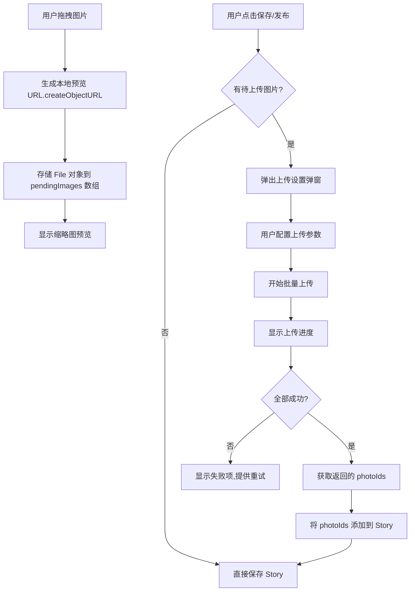

# 拖拽上传延迟发布功能实施计划

## 需求概述

在 admin/logs 编辑页面（StoriesTab.tsx）实现拖拽图片上传功能，支持：
1. 拖拽图片到右侧照片区域，显示本地预览（不立即上传）
2. 点击保存/发布时弹出设置弹窗，配置上传参数
3. 确认后先上传所有待上传图片，再保存日志数据

## 架构设计



## 数据结构

```typescript
// 待上传图片类型
interface PendingImage {
  id: string           // 临时 ID
  file: File           // 原始文件对象
  previewUrl: string   // 本地预览 URL (URL.createObjectURL)
  status: 'pending' | 'uploading' | 'success' | 'failed'
  progress: number     // 上传进度 0-100
  error?: string       // 错误信息
  photoId?: string     // 上传成功后的 photo ID
}

// 上传设置弹窗参数
interface UploadSettings {
  maxSizeMB?: number           // 压缩大小 (可选)
  storageProvider?: string     // 存储源 (可选)
  category?: string            // 分类 (可选)
  albumId?: string             // 相册 (可选)
}
```

## 组件修改

### 1. StoriesTab.tsx 修改

**新增状态：**
```typescript
const [pendingImages, setPendingImages] = useState<PendingImage[]>([])
const [showUploadSettings, setShowUploadSettings] = useState(false)
const [isUploading, setIsUploading] = useState(false)
```

**修改右侧照片面板：**
- 添加 `onDragOver`, `onDrop` 事件处理
- 混合显示已有照片和待上传图片
- 待上传图片显示特殊标记（如虚线边框）

**修改保存逻辑：**
- 检查是否有 pendingImages
- 有则弹出设置弹窗
- 上传完成后再执行原有保存逻辑

### 2. 新建 ImageUploadSettingsModal.tsx

弹窗组件，包含：
- 压缩大小设置（可选，数字输入）
- 存储源选择（可选，下拉框：local/r2/github）
- 分类输入（可选，文本输入）
- 相册选择（可选，下拉框）
- 确认/取消按钮

### 3. 上传进度显示

在保存按钮区域或弹窗中显示：
- 总体进度条
- 当前上传文件名
- 成功/失败计数
- 失败项重试按钮

## 实施步骤

### Step 1: 创建类型定义
在 StoriesTab.tsx 顶部添加 PendingImage 接口

### Step 2: 创建上传设置弹窗组件
新建 `src/components/admin/ImageUploadSettingsModal.tsx`

### Step 3: 修改 StoriesTab 照片面板
- 添加拖拽事件处理
- 添加 pendingImages 状态
- 修改照片网格渲染逻辑

### Step 4: 修改保存逻辑
- 拦截保存按钮点击
- 检查待上传图片
- 弹出设置弹窗
- 执行上传流程

### Step 5: 添加国际化文本
在 i18n.ts 添加相关翻译

## 关键代码片段

### 拖拽处理
```typescript
const handleDrop = async (e: React.DragEvent) => {
  e.preventDefault()
  const files = Array.from(e.dataTransfer.files).filter(f => f.type.startsWith('image/'))
  
  const newPending: PendingImage[] = files.map(file => ({
    id: crypto.randomUUID(),
    file,
    previewUrl: URL.createObjectURL(file),
    status: 'pending',
    progress: 0
  }))
  
  setPendingImages(prev => [...prev, ...newPending])
}
```

### 保存前检查
```typescript
const handleSaveStory = async () => {
  if (pendingImages.length > 0) {
    setShowUploadSettings(true)
    return
  }
  // 原有保存逻辑
  await saveStory()
}
```

### 上传流程
```typescript
const handleConfirmUpload = async (settings: UploadSettings) => {
  setShowUploadSettings(false)
  setIsUploading(true)
  
  const uploadedPhotoIds: string[] = []
  
  for (const pending of pendingImages) {
    try {
      // 压缩（如果设置了）
      let fileToUpload = pending.file
      if (settings.maxSizeMB) {
        fileToUpload = await compressImage(pending.file, settings.maxSizeMB)
      }
      
      // 上传
      const photo = await uploadPhotoWithProgress({
        token,
        file: fileToUpload,
        title: pending.file.name.replace(/\.[^/.]+$/, ''),
        category: settings.category,
        storage_provider: settings.storageProvider,
        onProgress: (p) => updatePendingProgress(pending.id, p)
      })
      
      uploadedPhotoIds.push(photo.id)
      updatePendingStatus(pending.id, 'success', photo.id)
    } catch (err) {
      updatePendingStatus(pending.id, 'failed', undefined, err.message)
    }
  }
  
  // 添加到 story
  if (uploadedPhotoIds.length > 0) {
    setCurrentStory(prev => ({
      ...prev!,
      photos: [...(prev?.photos || []), ...getPhotosById(uploadedPhotoIds)]
    }))
  }
  
  // 清理成功的 pending
  clearSuccessfulPending()
  setIsUploading(false)
  
  // 如果全部成功，继续保存
  if (pendingImages.filter(p => p.status === 'failed').length === 0) {
    await saveStory()
  }
}
```

## 注意事项

1. **内存管理**：使用 `URL.revokeObjectURL` 清理预览 URL
2. **错误处理**：上传失败时保留文件，允许重试
3. **用户体验**：上传过程中禁用保存按钮，显示进度
4. **参数可选**：所有上传设置参数都是可选的，不设置默认值