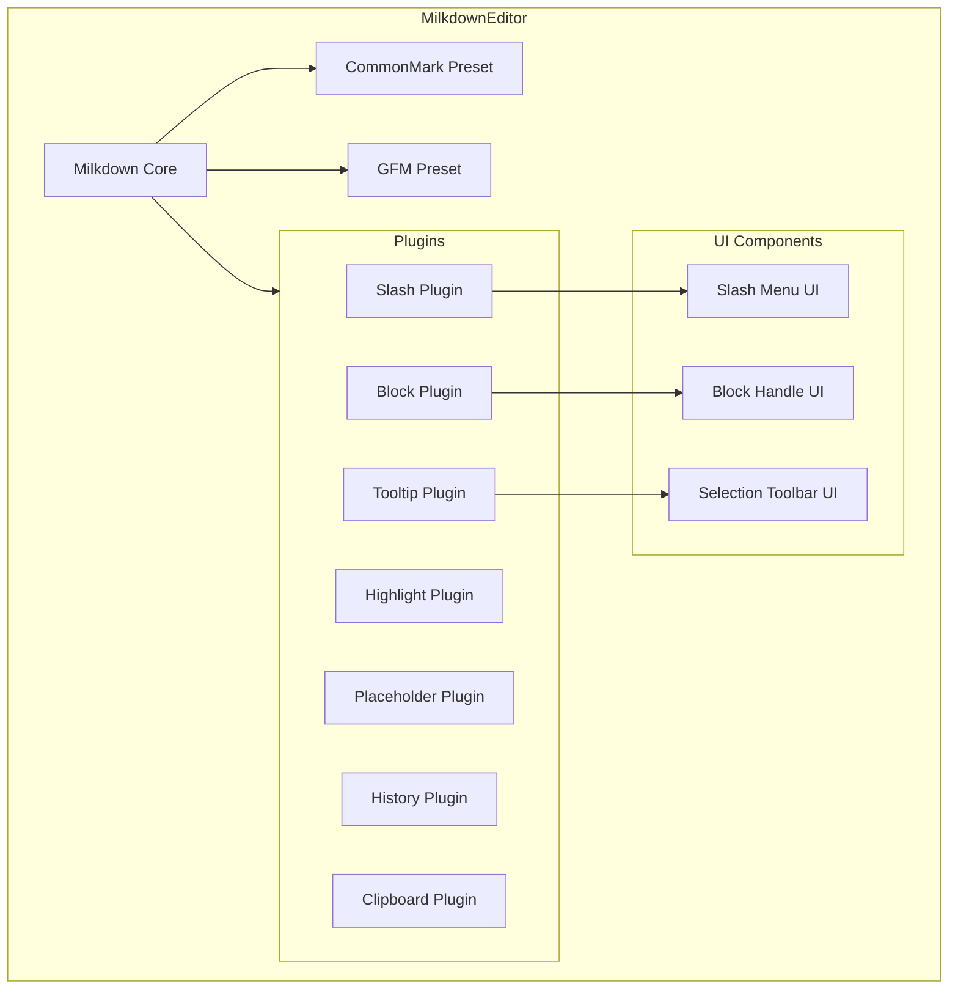
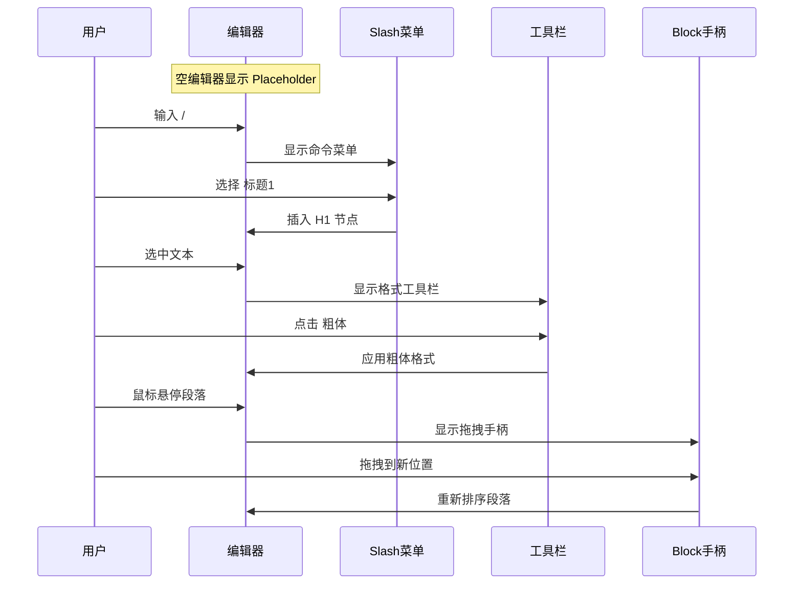

# Milkdown 编辑器增强计划

## 当前状态分析

当前编辑器 [`MilkdownEditor.tsx`](src/components/admin/MilkdownEditor.tsx) 已实现的功能：
- ✅ CommonMark 基础语法支持
- ✅ GFM (GitHub Flavored Markdown) 支持
- ✅ 历史记录 (撤销/重做)
- ✅ 剪贴板支持
- ✅ 光标增强
- ✅ 缩进支持
- ✅ 尾部空行处理
- ✅ 内容变化监听

**问题**：编辑器目前只有空白区域，缺乏可视化的交互元素，用户体验较差。

## 增强方案

### 1. Slash 命令菜单 (`@milkdown/plugin-slash`)

**功能描述**：
- 输入 `/` 触发命令菜单
- 快速插入：标题(H1-H6)、列表、代码块、引用、分割线、表格等
- 类似 Notion 的体验

**实现要点**：
```typescript
import { slashFactory, SlashProvider } from '@milkdown/plugin-slash'

// 创建菜单 DOM
const menu = document.createElement('div')
menu.className = 'slash-menu'

// 配置 SlashProvider
const provider = new SlashProvider({
  content: menu,
  shouldShow(view) {
    return provider.getContent(view)?.endsWith('/') ?? false
  }
})
```

### 2. Block 拖拽手柄 (`@milkdown/plugin-block`)

**功能描述**：
- 在每个块级元素左侧显示拖拽手柄 (≡)
- 支持拖拽重新排序段落
- 可添加 "+" 按钮快速插入新块

**实现要点**：
```typescript
import { block, BlockProvider } from '@milkdown/plugin-block'

// 创建拖拽手柄 DOM
const handle = document.createElement('div')
handle.className = 'drag-handle'
handle.innerHTML = '⋮⋮'

// 配置 BlockProvider
const provider = new BlockProvider({
  ctx,
  content: handle,
  getOffset: () => 8
})
```

### 3. 选中文本工具栏 (`@milkdown/plugin-tooltip`)

**功能描述**：
- 选中文本时显示浮动工具栏
- 快速应用：粗体、斜体、删除线、链接、代码等格式

**实现要点**：
```typescript
import { tooltipFactory, TooltipProvider } from '@milkdown/plugin-tooltip'

// 创建工具栏 DOM
const toolbar = document.createElement('div')
toolbar.className = 'selection-toolbar'
toolbar.innerHTML = `
  <button data-cmd="bold">B</button>
  <button data-cmd="italic">I</button>
  <button data-cmd="strike">S</button>
  <button data-cmd="link">🔗</button>
  <button data-cmd="code">&lt;/&gt;</button>
`
```

### 4. 代码块语法高亮 (`@milkdown/plugin-highlight`)

**功能描述**：
- 代码块显示彩色语法高亮
- 支持多种编程语言
- 使用 Shiki 或 Lowlight 作为解析器

**实现要点**：
```typescript
import { highlight, highlightPluginConfig } from '@milkdown/plugin-highlight'
import { createParser } from '@milkdown/plugin-highlight/shiki'

const parser = await createParser({
  theme: 'github-dark',
  langs: ['javascript', 'typescript', 'python', 'html', 'css', 'json', 'markdown']
})

ctx.set(highlightPluginConfig.key, { parser })
```

### 5. Placeholder 占位符 (`@milkdown/plugin-placeholder`)

**功能描述**：
- 空编辑器时显示提示文字
- 引导用户开始输入

**实现要点**：
```typescript
import { placeholder, placeholderConfig } from '@milkdown/plugin-placeholder'

ctx.set(placeholderConfig.key, {
  text: '输入 "/" 打开命令菜单，或直接开始输入...'
})
```

### 6. 样式优化

**需要更新的样式**：
- Slash 菜单样式（下拉菜单、选项高亮）
- Block 手柄样式（拖拽图标、悬停效果）
- 工具栏样式（按钮、分隔线、激活状态）
- 代码块样式（语法高亮主题）
- Placeholder 样式（提示文字颜色、字体）

## 需要安装的依赖

```bash
pnpm add @milkdown/plugin-slash @milkdown/plugin-block @milkdown/plugin-tooltip @milkdown/plugin-highlight @milkdown/plugin-placeholder shiki
```

## 文件修改清单

1. **[`package.json`](package.json)** - 添加新依赖
2. **[`src/components/admin/MilkdownEditor.tsx`](src/components/admin/MilkdownEditor.tsx)** - 集成新插件
3. **[`src/components/admin/milkdown-editor.css`](src/components/admin/milkdown-editor.css)** - 添加新样式
4. **新建 `src/components/admin/milkdown/`** - 可选，拆分组件
   - `SlashMenu.tsx` - Slash 菜单组件
   - `BlockHandle.tsx` - Block 手柄组件
   - `SelectionToolbar.tsx` - 选中工具栏组件

## 架构图



## 用户交互流程



## 预期效果

增强后的编辑器将具备：

1. **更好的可发现性** - Placeholder 提示用户如何开始
2. **更快的输入效率** - Slash 命令快速插入各种元素
3. **更直观的格式化** - 选中文本即可看到格式化选项
4. **更灵活的编辑** - 拖拽手柄轻松调整内容顺序
5. **更美观的代码** - 语法高亮让代码更易读

## 实施顺序

1. 安装依赖
2. 添加 Placeholder 插件（最简单，立即可见效果）
3. 添加 Slash 命令菜单（核心功能）
4. 添加选中文本工具栏（常用功能）
5. 添加 Block 拖拽手柄（高级功能）
6. 添加代码高亮（可选增强）
7. 优化样式和交互细节